# Achados e Perdidos do CI

Sistema web de achados e perdidos do Centro de Informatica da UFPB com Django, PostgreSQL, Tailwind CSS e Docker Compose. O projeto centraliza a consulta publica dos itens encontrados e o registro interno feito pela equipe responsavel.

## O que o projeto faz

- home com os 3 itens mais recentes
- catálogo completo em `/posts/`
- login e cadastro de usuários internos
- cadastro de item com imagem, local e observações
- edição e exclusão pelo autor do item
- painel administrativo em `/admin/`

## Rodando com Docker

```bash
git clone <URL_DO_REPOSITORIO>
cd achados_ufpb
cp .env-example .env
docker compose up --build -d
docker compose exec web python manage.py migrate
docker compose exec web python manage.py createsuperuser
```

Acesse:

- app: [http://localhost:8000](http://localhost:8000)
- admin: [http://localhost:8000/admin/](http://localhost:8000/admin/)

## Comandos úteis

```bash
docker compose exec web python manage.py migrate
docker compose exec web python manage.py createsuperuser
docker compose logs -f
docker compose down
```

## Ambiente

O projeto usa estas variáveis:

```env
DB_NAME=achados_db
DB_USER=postgres
DB_PASSWORD=postgres
DB_HOST=db
DB_PORT=5432
```

Arquivos disponíveis:

- `.env-example`: modelo base
- `.env`: configuração local já alinhada ao Docker Compose Que deve ser mudada para garantir segurança em produção. 

Sem Docker, basta apontar o `.env` para um PostgreSQL local, rodar `python app/manage.py migrate` e iniciar com `python app/manage.py runserver`.

## Troubleshooting

- banco não conecta: confirme `docker compose ps` e revise o `.env`
- tabelas não existem: rode `docker compose exec web python manage.py migrate`
- imagens não aparecem: verifique se o item foi salvo com arquivo válido e se a stack foi iniciada corretamente

## Screenshots

### Desktop

#### Home

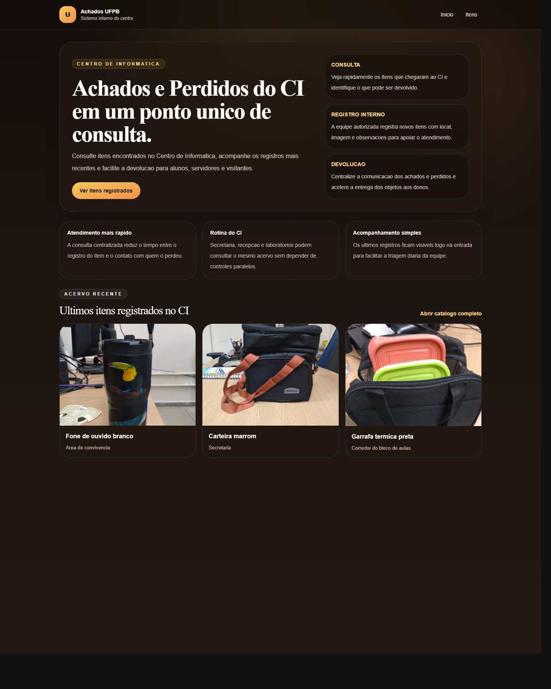

#### Login

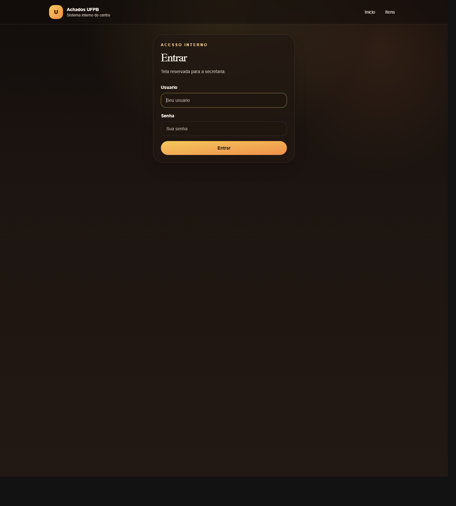

#### Cadastro

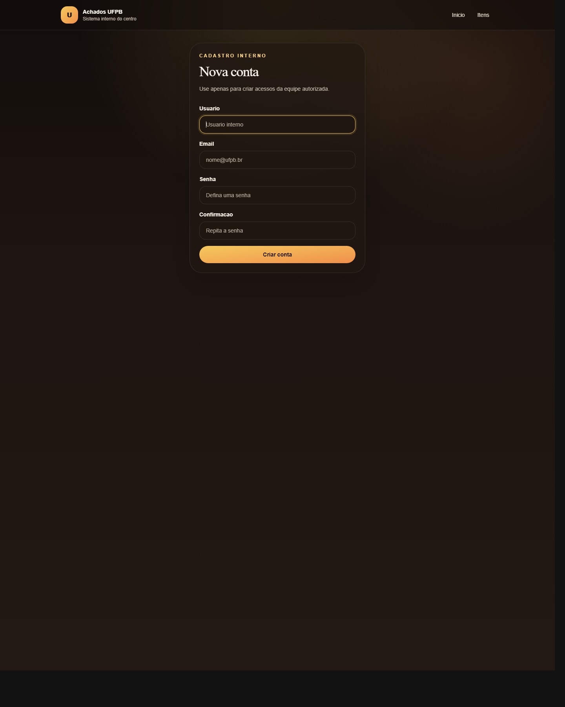

#### Lista de itens

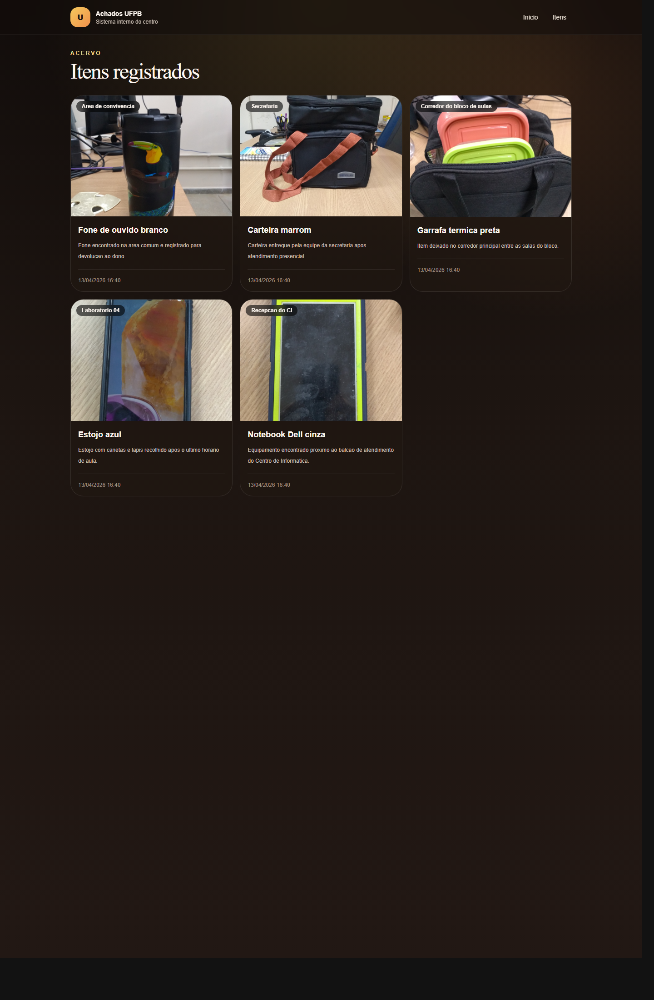

#### Novo item

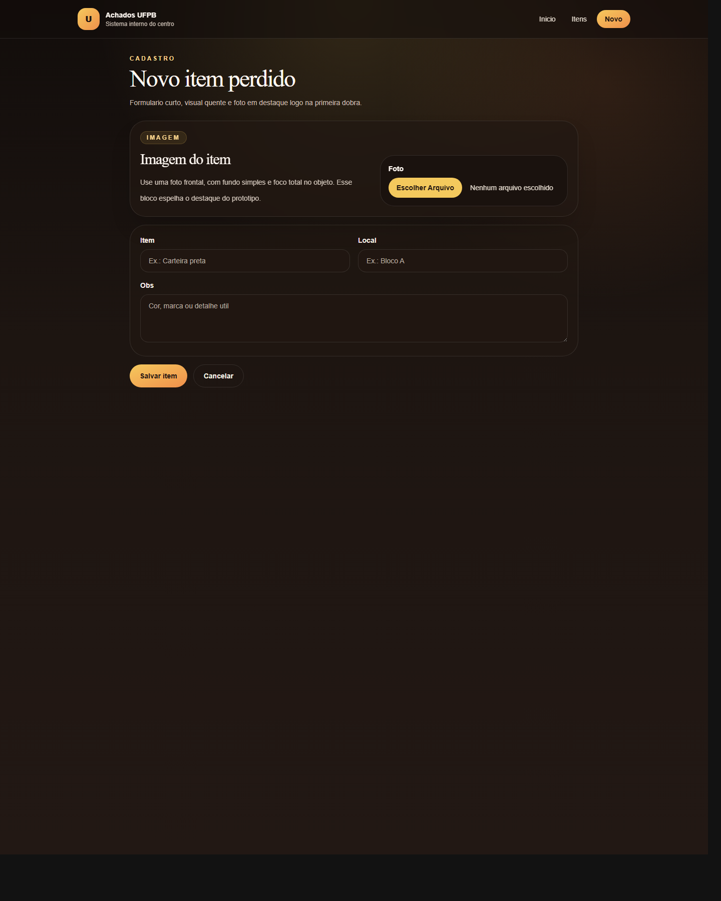

#### Exclusão

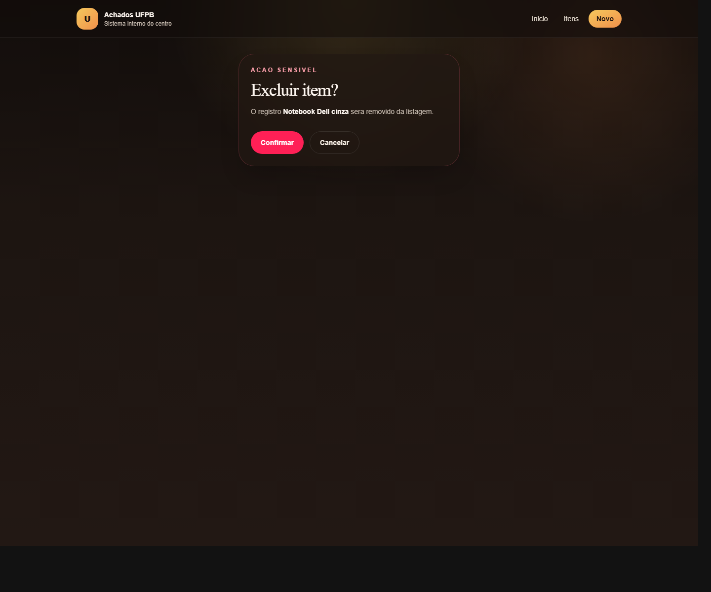

#### Admin

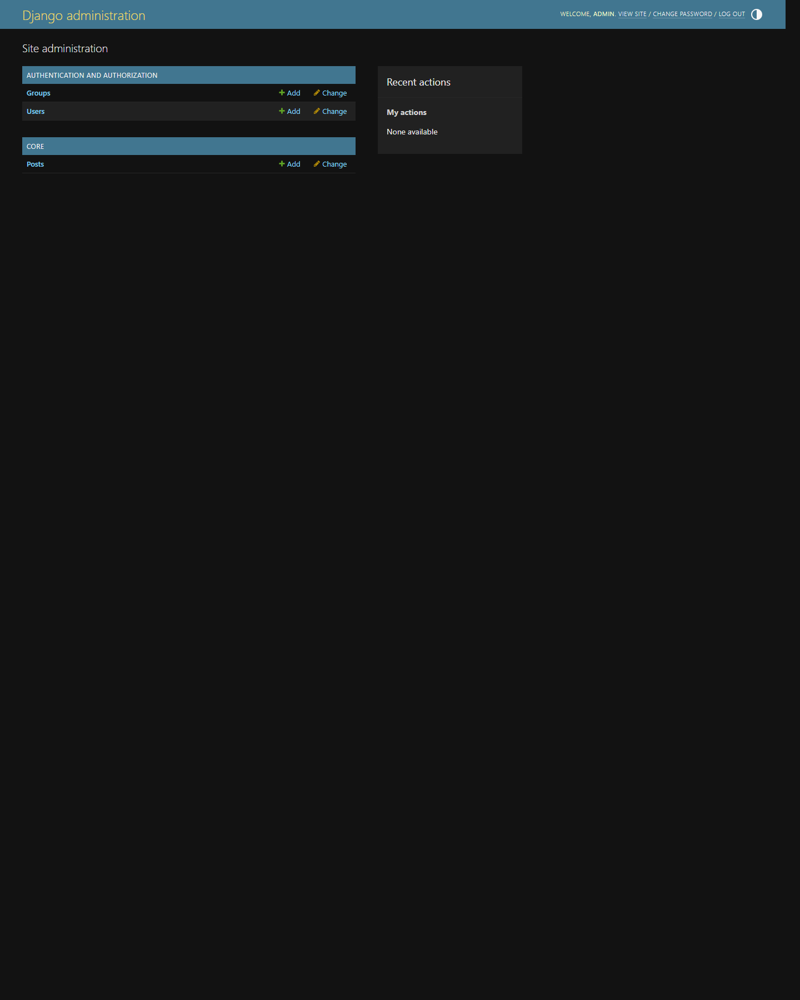

### Mobile

#### Home

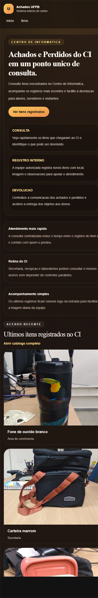

#### Login

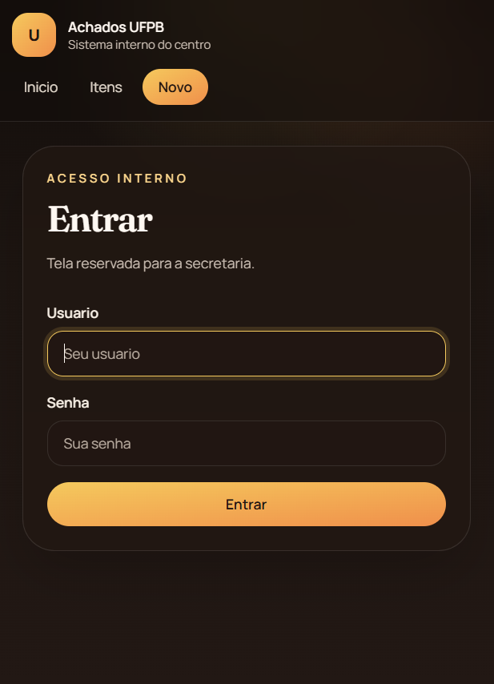

#### Cadastro

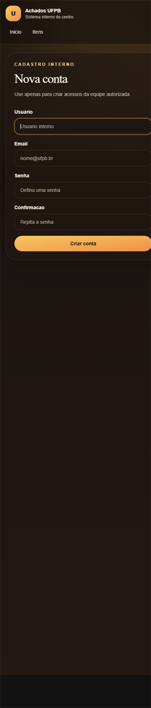

#### Lista de itens

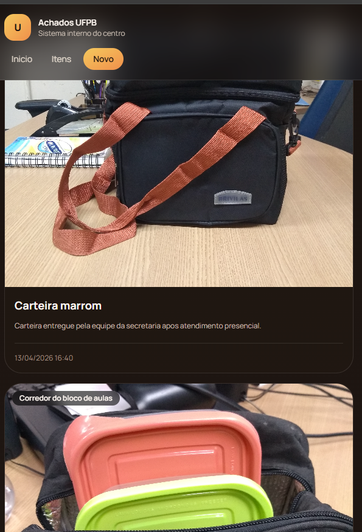

#### Novo item

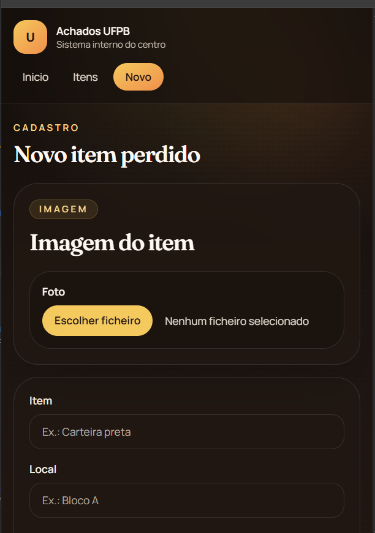

